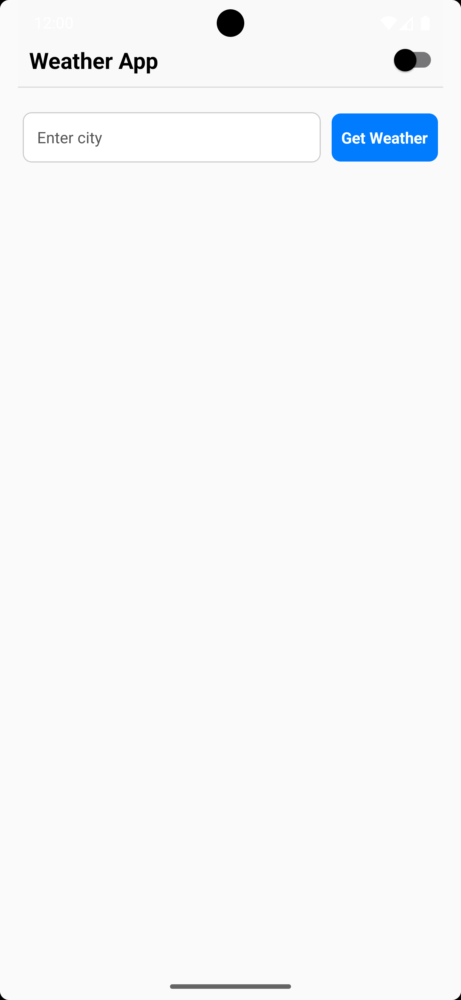
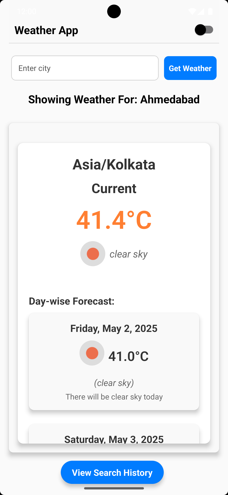

# Weather App

A React Native app that provides weather information based on city search. It features the ability to search for weather by city, view previous searches, and toggle between light and dark themes. The app utilizes Redux for state management, AsyncStorage for persistent city data, and the OpenWeatherMap and OpenCage API services for fetching weather and city coordinates.

## Features
- Search for weather by city name.
- View weather data, including temperature, humidity, and more.
- View search history and select a previously searched city.
- Toggle between light and dark modes.
- Redux Toolkit for efficient state management.
- AsyncStorage to persist last searched city.

## Requirements
- React Native (v0.64+)
- Node.js (v14+)
- Yarn (or npm)

## ENV Data (for testing only)
```env
REACT_NATIVE_OPENWEATHER_API_KEY=5ce13d67968afe8e61db635add70decf
REACT_NATIVE_OPENCAGE_API_KEY=928226e905344bccbd9c79dcb0adc1b8
```

## Prerequisites
1. [Node.js](https://nodejs.org/)
2. [Yarn](https://classic.yarnpkg.com/en/docs/install/)
3. [React Native CLI](https://reactnative.dev/docs/environment-setup)
4. Xcode (iOS) or Android Studio (Android)

## Installation

```bash
git clone <repo-url>
cd weather-app
yarn install
# or
npm install
```

## Add Environment File

Create a `.env` file in the root and paste the API keys provided above.

## Running the App

### Android

```bash
yarn android
# or
npx react-native run-android
```

### iOS (Mac Only)

```bash
cd ios && pod install && cd ..
yarn ios
# or
npx react-native run-ios
```

## Testing

```bash
yarn test
```

Uses Jest and @testing-library/react-native for unit testing.

## Architecture Decisions

- **UI Layer**: All screens and components are purely presentational.
- **Redux Layer**: Manages all app-wide state like weather, theme, and history.
- **Service Layer**: Centralized API logic (`weatherService.ts`).
- **Custom Hooks**: Support reusable business logic between components.
- **Styling Layer**: Styles are kept modular and centralized (`styles/`).
- **Configuration**: All sensitive or environment-specific values are stored in `.env`.

This architecture provides clean separation of concerns, scalability, testability, and maintainability.

## Project Structure

```
weather-app/
│
├── components/         # Reusable UI components
├── screens/            # App screens (e.g., HomeScreen)
├── redux/              # Redux store and slices
├── services/           # API service logic
├── styles/             # Modular styling files
├── hooks/              # Reusable logic (optional)
├── App.tsx             # Root component
├── .env                # API keys
└── README.md           # Documentation
```

## Assessment Guidelines Coverage

- ✅ Scalable and maintainable modular codebase
- ✅ Stable and performant under load
- ✅ Compatible with all devices
- ✅ No inline styles — fully modular styling
- ✅ Modern API integration with async/await
- ✅ UI components separated from logic
- ✅ Centralized state in Redux
- ✅ API logic isolated in service layer
- ✅ `.env` used for config and secrets
- ✅ All components follow Single Responsibility Principle
- ✅ Reusable services and hooks
- ✅ Clear separation between business and presentation logic

## Screenshots

### City Home Screen


### City One Screen


### City Two Screen


### History Screen


### 🌙 Dark Mode
